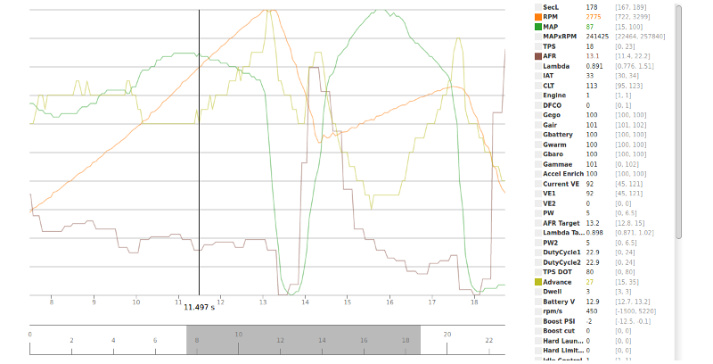

# MSL Viewer

A minimalistic approach to datalog visualization.

This application tries to provide an easy way of getting an overview of different engine variables and their variation with time.

Simply load an MSL file generated by your engine management and tuning software (such as TunerStudio) and select the records you'd like to display as line graphs.

Preview: https://htmlpreview.github.io/?https://github.com/breakfastmotorsport/msl-viewer/blob/master/index.html

## Technical Aspects

This application does not use external resources. It uses D3.js as a basis for the interactive data visualization.

At the moment this application is considered a (working) prototype. There is still some testing and tidying to do.